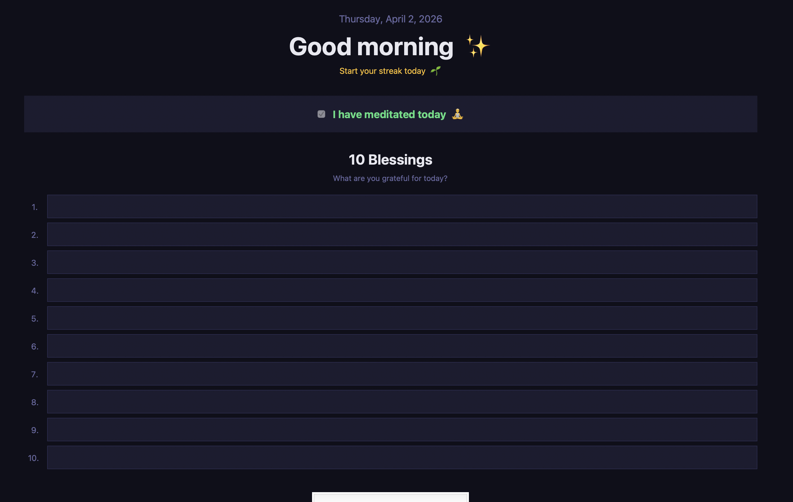

# 🌅 Morning Ritual Gate

A macOS app that **blocks your computer every morning** until you've meditated and written 10 blessings.

Once you complete your ritual, your Mac unlocks. Your blessings are saved to a daily journal with the date, time, and your current streak.



---

## What it does

- 🔒 Fullscreen gate appears every time you **open your laptop lid** (or restart)
- 🧘 Requires you to check off that you've meditated
- 🙏 Requires you to write 10 things you're grateful for
- 🔥 Tracks your **daily streak**
- 📓 Saves every entry to a **journal file** with date, time & streak day
- ✅ If you've already completed it today, it auto-dismisses

### Journal entry example
```
────────────────────────────────────────────────────────────────
  Thursday, April 3, 2026  ·  7:42 AM  ·  Day 4 🔥
────────────────────────────────────────────────────────────────
   1. I'm grateful for my health
   2. I'm grateful for my family
   ...
```

---

## Requirements

- macOS
- Python 3 — download from [python.org](https://www.python.org) or install via Homebrew

---

## Install

**1. Clone or download this repo, then open Terminal and run:**

```bash
bash ~/Documents/MorningRitual/setup.sh
```

That's it. The setup script will:
- Install [Homebrew](https://brew.sh) (if you don't have it)
- Install `sleepwatcher` (triggers the gate on lid open / wake from sleep)
- Register the app to run at every login too

**2. Test it works:**

```bash
python3 ~/Documents/MorningRitual/morning_ritual.py
```

---

## Journal location

Your blessings are saved to:

```
~/Documents/MorningRitual/blessings_journal.txt
```

If iCloud Drive is enabled on your Mac, it saves there instead and syncs to your iPhone/iPad automatically.

---

## Uninstall

```bash
launchctl unload ~/Library/LaunchAgents/com.morningritual.gate.plist
rm ~/Library/LaunchAgents/com.morningritual.gate.plist
rm ~/.wakeup
```

---

## The story behind this

I built this in April 2026, during my PhD.

PhD life is strange — nobody tells you what to do or when to show up. No schedule, no manager, no structure unless you create it yourself. That freedom sounds great until you realise how easy it is to drift. Days blur together. Motivation comes and goes. And the first thing that disappears when things get hard is the small habits that actually keep you grounded.

I'd been trying to meditate every morning and write 10 things I was grateful for — not because anyone told me to, but because it genuinely made my days better. The problem was that "trying" wasn't enough. Some mornings I'd open my laptop, get sucked into emails or research, and the ritual just wouldn't happen.

So I thought — what if the computer simply didn't work until I did it?

No willpower needed. No reminders to ignore. Just: you open your laptop, the gate is there, and your day doesn't start until your ritual is done.

It's a small thing. But during a PhD, when the loneliness and the pressure and the lack of structure can quietly wear you down, small things matter a lot. This is my way of making sure I start every single day with intention — no matter what.
